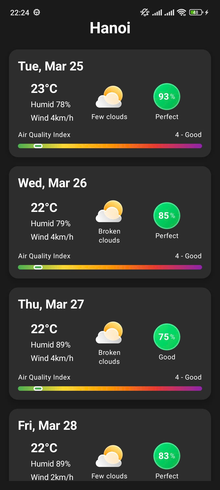

# Hanoi Bike Day

A simple Android application that helps cyclists in Hanoi plan their rides based on weather conditions and air quality. 
The app provides a comprehensive view of daily weather forecasts along with biking suitability scores and air quality information.
Weather API: OpenWeatherMap

## Features

- **Daily Weather Forecast**: Detailed weather information including temperature, humidity, and wind speed
- **Biking Score**: Custom scoring system indicating how suitable the weather is for cycling
- **Air Quality Index**: Real-time air quality measurements with visual indicators
- **Modern UI**: Material Design 3 implementation with a clean, intuitive interface
- **Visual Weather Indicators**: Custom icons for different weather conditions

## Screenshots

## Technical Stack

- **Language**: Kotlin
- **UI Framework**: Jetpack Compose
- **Architecture**: MVVM (Model-View-ViewModel)
- **Dependencies**:
  - AndroidX Compose
  - Material Design 3
  - Kotlin Coroutines
  - ViewModel
  - LiveData

## Weather Icons

The app uses custom weather icons for the following conditions:
- Clear weather (`ic_clear.png`)
- Cloudy conditions (`ic_clouds.png`)
- Rain (`ic_rain.png`)
- Thunderstorm (`ic_thunderstorm.png`)
- Unknown/Default (`ic_unknown.png`)

## Biking Score System

The biking score is calculated based on various weather parameters and is displayed with color-coded indicators:
- 81-100: Perfect (Green)
- 61-80: Good (Light Green)
- 41-60: Moderate (Yellow)
- 21-40: Fair (Orange)
- 0-20: Poor (Red)

## Air Quality Index

The app displays real-time air quality information with a gradient indicator showing:
- Good (Green)
- Moderate (Yellow)
- Unhealthy for Sensitive Groups (Orange)
- Unhealthy (Red)
- Very Unhealthy (Purple)

